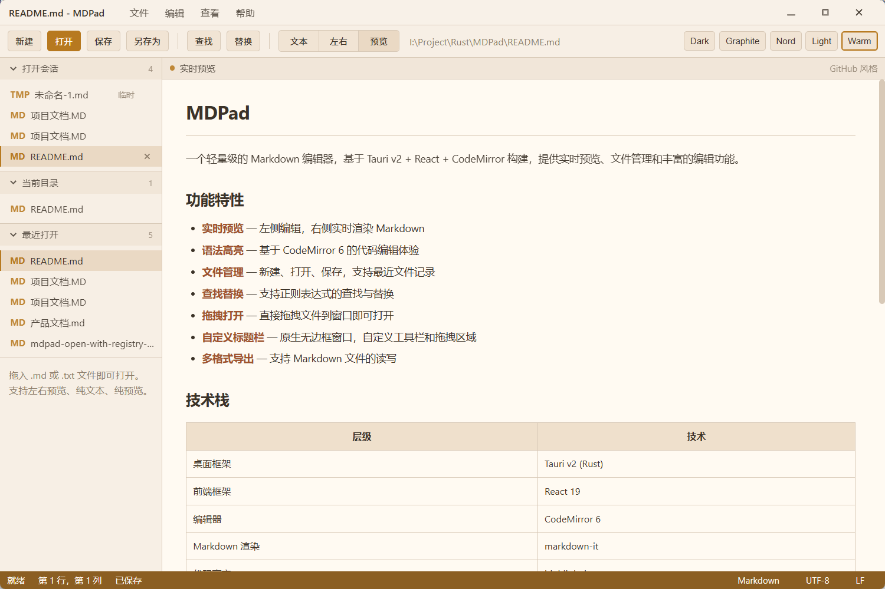
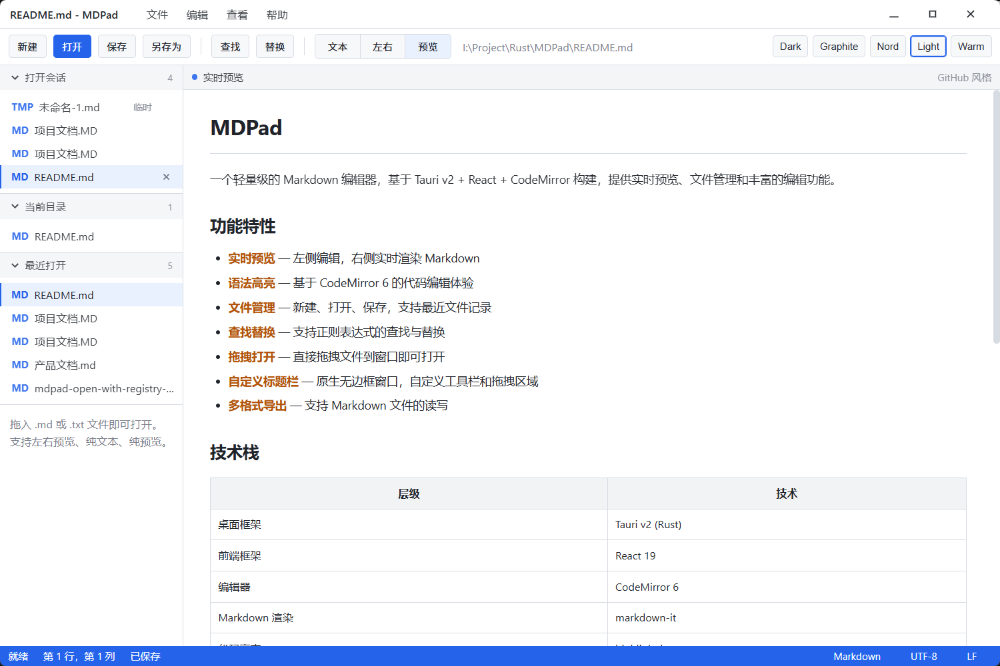
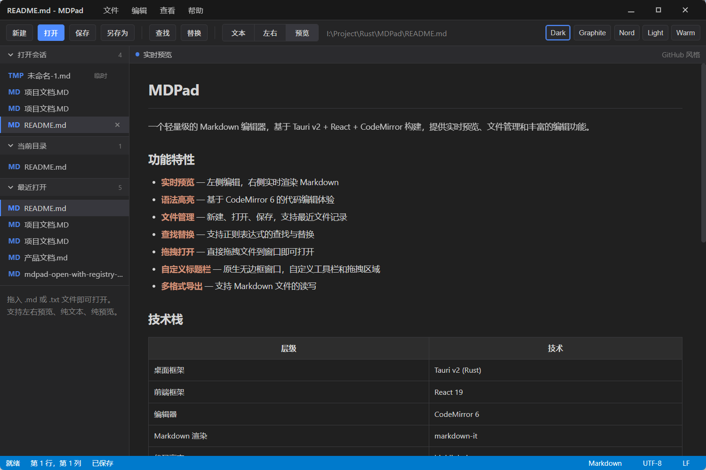
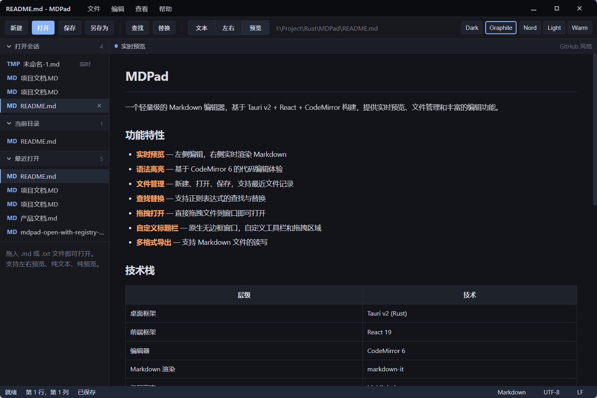
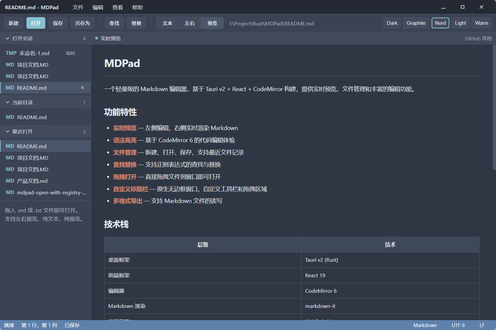

# MDPad

一个轻量级的 Markdown 编辑器，基于 Tauri v2 + React + CodeMirror 构建，提供实时预览、文件管理和丰富的编辑功能。

## 功能特性

- **实时预览** — 左侧编辑，右侧实时渲染 Markdown
- **语法高亮** — 基于 CodeMirror 6 的代码编辑体验
- **文件管理** — 新建、打开、保存，支持最近文件记录
- **查找替换** — 支持正则表达式的查找与替换
- **拖拽打开** — 直接拖拽文件到窗口即可打开
- **自定义标题栏** — 原生无边框窗口，自定义工具栏和拖拽区域
- **多格式导出** — 支持 Markdown 文件的读写

## 技术栈

| 层级 | 技术 |
|------|------|
| 桌面框架 | Tauri v2 (Rust) |
| 前端框架 | React 19 |
| 编辑器 | CodeMirror 6 |
| Markdown 渲染 | markdown-it |
| 代码高亮 | highlight.js |
| 构建工具 | Vite 8 |

## 开发

```bash
# 安装依赖
npm install

# 启动开发模式
npm run tauri dev

# 构建生产版本
npm run tauri build
```

### 环境要求

- Node.js >= 20
- Rust >= 1.77.2
- Windows / macOS / Linux

## 下载安装

前往 [Releases](../../releases) 页面下载对应平台的安装包：

- **Windows**: `.msi` 或 `.exe` 安装包
- **macOS**: `.dmg`
- **Linux**: `.deb` / `.AppImage`

## 主题预览











## 许可证

MIT License
